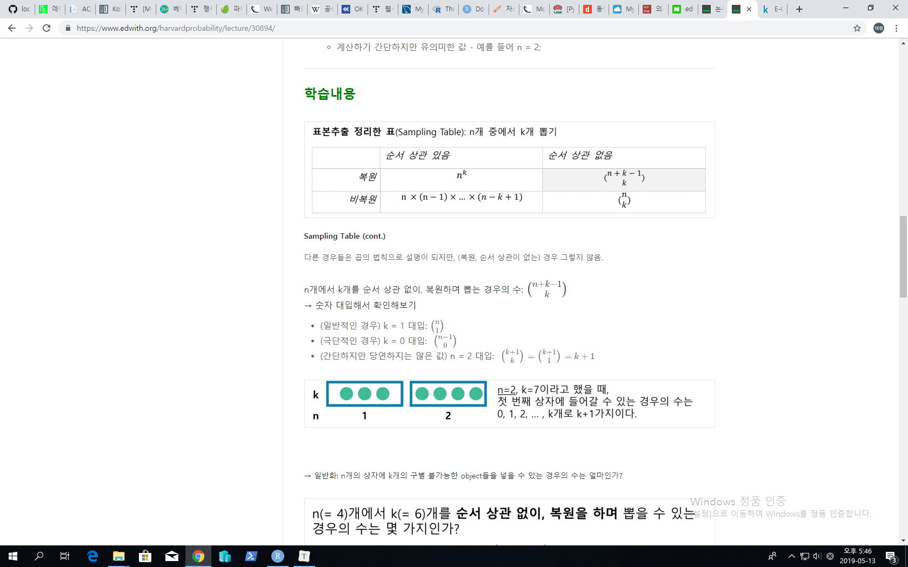
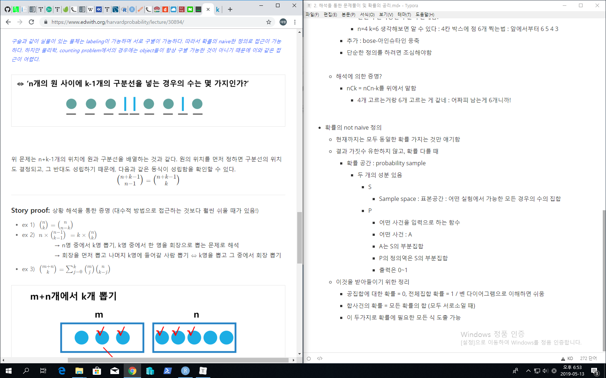

# 2. 해석을 통한 문제풀이 및 확률의 공리

- <https://www.edwith.org/harvardprobability/lecture/30894/>

- 문제풀이 팁

  - 답안이 합리적. 의미가 있어야 함

    - don't lose common sense

  - 답 한번더 체크

    - do check the answer by doing simple & extreme case

  - lable을 해놓아라 

    - lable people, objects, etc

      - 네가 기준을 가지고 구분할 수 있게

      - 그냥 순서가 있고 없고를 따지는 게 아니라 상황을 잘 이해하고 그에 맞게 생각

        - 10C4=10C6, 반면 10C5/2
          - 왜냐하면 두 팀에 차이가 있다고 한적이 없으니! 그냥 두팀으로 나누라함

      - 올바르게 구조화시키면 경우의 수 마다 확률이 같다고 생각할 수 있을 것 / or not

        

- ## 지난시간 이어서

  - 
  - 순서상관 x / 복원적용 : 중복조합: n+k-1Ck
    - k=0 아무것도 안하는거 : 1 맞네 / 0!=1
    - n=2 이면  k+1Ck=k+1C1=k+1
      - k가 7이라고 가정하면
      - 박스 2개 그려놓고 생각하면 편함 : 0/7, 1/6, ... , 6/1, 7/0 => k+1=7+1=8개 ok!
    - 즉, 확대해서 생각하면 n개의 구분 가능한 박스, k개의 구분 불가능한 점찍기!
      - 완전히 불가능한 구분이 존재함!
      - n=4 k=6 생각해보면 알 수 있다 : 4칸 박스에 점 6개 찍는법 : 앞에서부터 6 5 4 3
    - 추가 : bose-아인슈타인 응축
    - 단순한 정의를 하려면 조심해야함

  

  - 해석에 의한 증명?
    - nCk = nCn-k를 위에서 말함
      - 4개 고르는거랑 6개 고르는 게 같네 : 어짜피 남는게 6개니까!
    - 

- 확률의 not naive 정의
  - 현재까지는 모두 동일한 확률 가지는 것만 얘기함
  - 결과 가짓수 유한하지 않고, 확률 다를 때
    - 확률 공간 : probability sample
      - 두 개의 성분 있음
        - S
          - Sample space : 표본공간 : 어떤 실험에서 가능한 모든 경우의 수의 집합
        - P
          - 어떤 사건을 입력으로 하는 함수
          - 어떤 사건 : A
          - A는 S의 부분집합
          - P의 정의역은 S의 부분집합
          - 출력은 0~1
  - 이것을 받아들이기 위한 정리
    - 공집합에 대한 확률 = 0, 전체집합 확률 = 1 / 벤 다이어그램으로 이해하면 쉬움
    - 합사건의 확률 = 모든 확률의 합 (모두 서로소일 때)
    - 이 두가지로 확률에 필요한 모든 식 도출 가능