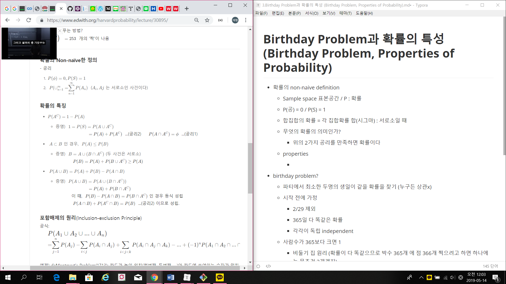
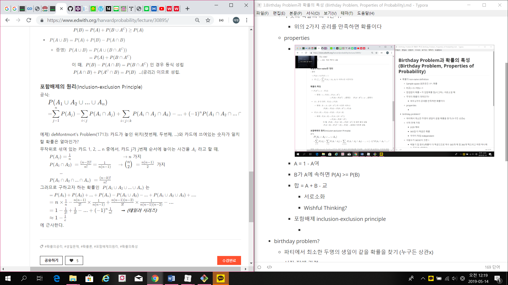

# Birthday Problem과 확률의 특성 (Birthday Problem, Properties of Probability)

- 확률의 non-naive definition
  - Sample space 표본공간 / P : 확률
  - P(공) = 0 / P(S) = 1
  - 합집합의 확률 = 각 집합확률 합(시그마) : 서로소일 때 (disjoint)
  - 무엇의 확률의 의미인가?
    - 위의 2가지 공리를 만족하면 확률이다
  - properties
    - 
    - A = 1 - A여
    - B가 A에 속하면 P(A) >= P(B)
    - 합 = A + B - 교
      - 서로소화
      - Wishful Thinking?
    - 포함배제 inclusion-exclusion principle
      - 
      - 드 몽모르트 문제 = 매칭 문제
        - 사건 정의 : Aj - j번째 카드가 매칭되는 상황
- birthday problem?
  - 파티에서 최소한 두명의 생일이 같을 확률을 찾기 (누구든 상관x)
  - 시작 전에 가정
    - 2/29 제외
    - 365일 다 똑같은 확률
    - 각각이 독립 independent
  - 사람수가 365보다 크면 1
    - 비둘기 집 원리 (확률이 다 똑같으므로 박수 365개 에 점 366개 찍으려고 하면 하나에는 무조건 2개겠지)
  - 사람수가 365보다 작거나 같으면
    - 놀랍게도 23명! - 50.7%
    - 왜?
      - 여집합을 구하변 됨 = 1 - P(다 다를 사건) = 1 - 365Pk/365^k
      - 지수함수 근사법 사용가능
    - P(1팀이라도 같을 확률)
      - 23 - 50.7%
      - 50 - 97%
      - 100 - 99.999%
  - k명이 있다고 할때 중요한건 k명이 아님
    - k명 중 2명 뽑으니 kC2 = k(k-1)/2 가 중요
      - 23명의 경우 253가짓수 : 이제야 직관적으로 23명만 있어도 일어날 수 있겠다 생각듬
  - 