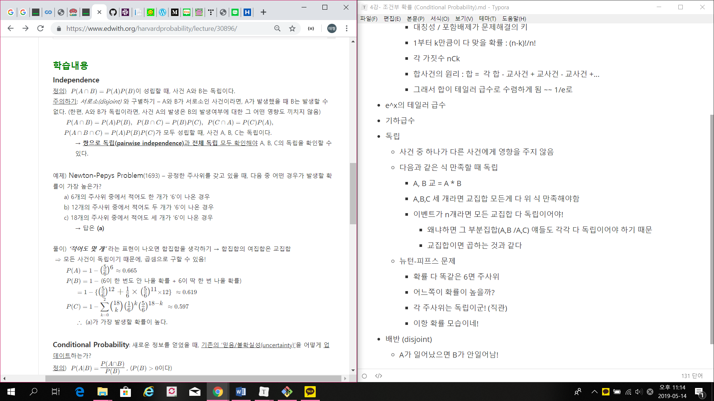
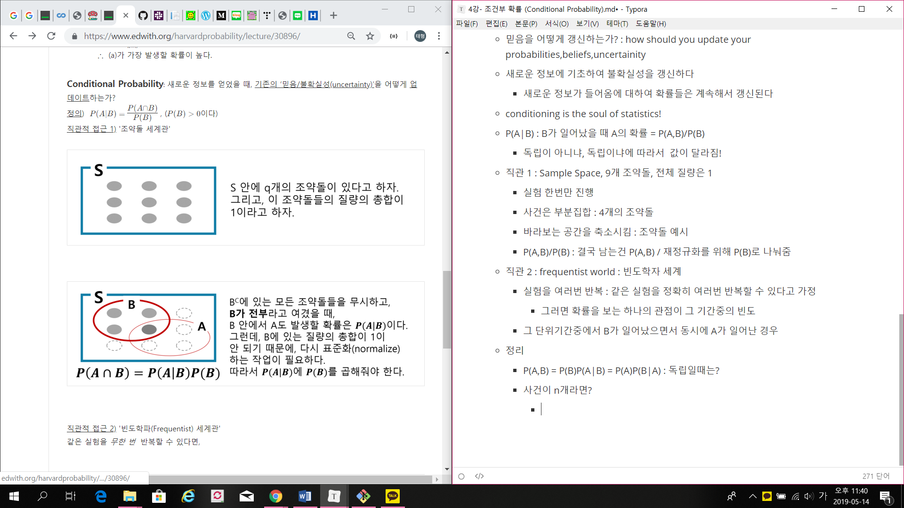
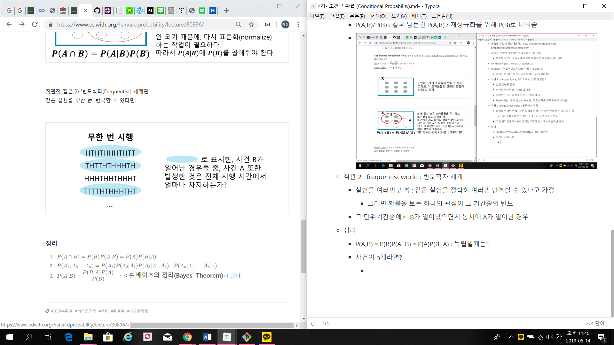

# 4강- 조건부 확률 (Conditional Probability)

- 포함-배제 include-exclude
  - 전체 = 각 합 - 교사건 + 교사건 - 교사건 +...
- matching !
  - Aj번째에 j카드가 나오는 것 : 확률 생각 : 
    - 대칭성 / 포함배제가 문제해결의 키
    - 1부터 k만큼이 다 맞을 확률 : (n-k)!/n!
    - 각 가짓수 nCk
    - 합사건의 원리 : 합 =  각 합 - 교사건 + 교사건 - 교사건 +...
    - 그래서 합이 테일러 급수로 수렴하게 됨 ~~ 1/e로
- e^x의 테일러 급수
- 기하급수
- 독립
  - 사건 중 하나가 다른 사건에게 영향을 주지 않음
  - 다음과 같은 식 만족할 때 독립
    - A, B 교 = A * B
    - A,B,C 세 개라면 교집합 모든게 다 위 식 만족해야함
    - 이벤트가 n개라면 모든 교집합 다 독립이어야!
      - 왜냐하면 그 부분집합(A,B /A,C) 얘들도 각각 다 독립이어야 하기 때문
      - 교집합이면 곱하는 것과 같다
  - 뉴턴-피프스 문제
    - 확률 다 똑같은 6면 주사위
    - 어느쪽이 확률이 높을까?
    - 각 주사위는 독립이군! (직관) 
    - 이항 확률 모습이네!
    - 
- 배반 (disjoint)
  - A가 일어났으면 B가 안일어남!
- 조건부 확률
  - 믿음을 어떻게 갱신하는가? : how should you update your probabilities,beliefs,uncertainity
  - 새로운 정보에 기초하여 불확실성을 갱신하다
    - 새로운 정보가 들어옴에 대하여 확률들은 계속해서 갱신된다
  - conditioning is the soul of statistics!
  - P(A|B) : B가 일어났을 때 A의 확률 = P(A,B)/P(B)
    - 독립이 아니냐, 독립이냐에 따라서  값이 달라짐!
  - 직관 1 : Sample Space, 9개 조약돌, 전체 질량은 1
    - 실험 한번만 진행
    - 사건은 부분집합 : 4개의 조약돌
    - 바라보는 공간을 축소시킴 : 조약돌 예시
    - P(A,B)/P(B) : 결국 남는건 P(A,B) / 재정규화를 위해 P(B)로 나눠줌
    - 
  - 직관 2 : frequentist world : 빈도학자 세계
    - 실험을 여러번 반복 : 같은 실험을 정확히 여러번 반복할 수 있다고 가정
      - 그러면 확률을 보는 하나의 관점이 그 기간중의 빈도
    - 그 단위기간중에서 B가 일어났으면서 동시에 A가 일어난 경우
  - 정리
    - 
    - P(A,B) = P(B)P(A|B) = P(A)P(B|A) : 독립일때는?
    - 사건이 n개라면? : 위의 것 귀납적으로 적용 : n!가짓수! (각 Ak를 맘대로 조합할 수 있음)
      - *P*(*A*1,*A*2,...*A**n*)=*P*(*A*1)*P*(*A*2∣*A*1)*P*(*A*3∣*A*1,*A*2)...*P*(*A**n*∣*A*1,...,*A**n*−1)
    - P(A|B) = P(B|A)P(A)/P(B) : 베이즈의 정리