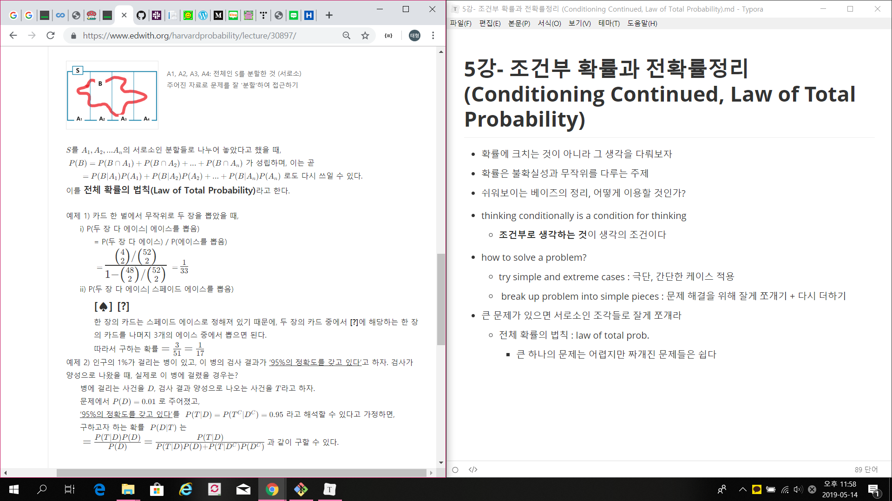
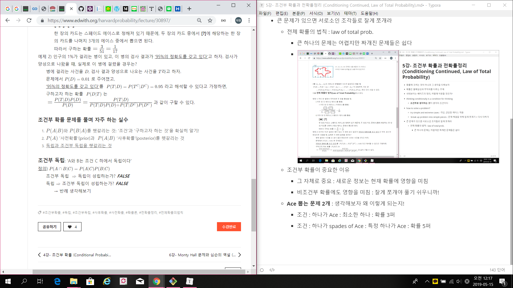

# 5강- 조건부 확률과 전확률정리 (Conditioning Continued, Law of Total Probability)

- 확률에 크치는 것이 아니라 그 생각을 다뤄보자

- 대칭성 : 딴놈들이 다 확률이 같네?

- 확률은 불확실성과 무작위를 다루는 주제

- 쉬워보이는 베이즈의 정리, 어떻게 이용할 것인가?

- thinking conditionally is a condition for thinking 
  
- **조건부로 생각하는 것**이 생각의 조건이다
  
- how to solve a problem?
  - try simple and extreme cases : 극단, 간단한 케이스 적용
  -  break up problem into simple pieces : 문제 해결을 위해 잘게 쪼개기 + 다시 더하기
  
- 큰 문제가 있으면 서로소인 조각들로 잘게 쪼개라
  - 전체 확률의 법칙 : law of total prob.
    - 큰 하나의 문제는 어렵지만 짜개진 문제들은 쉽다
    - 
  - 조건부 확률이 중요한 이유
    - 그 자체로 중요 : 새로운 정보는 현재 확률에 영향을 미침
    - 비조건부 확률에도 영향을 미침 : 잘게 쪼개야 풀기 쉬우니까!
  - **Ace 뽑는 문제 2개** : 생각해보자 왜 이렇게 되는지!
    - 조건 : 하나가 Ace : 최소한 하나 : 확률 3퍼
    - 조건 : 하나가 spades of Ace : 특정 하나가 Ace : 확률 5퍼
  - 
  - 어떤 조건 가지고 있을지 생각해야 할 것
    - 인구 1%가 병걸림
    - 양성판정은 95% 정확도
    - 병에 걸리는 사건 D
    - 양성 판정 사건 T
    - 일어나는 확률이 직관과 다를 때가 많다
      - 왜 직관이 틀린가? 사람들은 95%에 집중하지, 1%에 집중하지않음
      - 질병이 더 드물지 vs 검사가 틀리는게 더 드물지
      - 우리는 질병이 드물지는 고려하지 않았기에 이러한 일이 일어남
    - 빈도학파
      - 같은 실험 여러번 : 1000명 있다고 했을 때
        - 실제 병 걸린 사람은 10명 / 양성판정은 50명 나올 것
        - 5대 1정도의 비율 : 실제 확률은 16퍼센트
    - 만약 환자가 증상을 가지고 있다던지 하는 일이 있다면 확률은 변경될 것
      - 정보에 따라 업데이트 된다 (1%로 고정된 것이 아님)
  - 베이즈 룰
    - 일관성의 원리
      - 하나가 아닌 두조각의 정보를 가졌을 때
      - 두개의 단서를 베이즈 정리로 함께 갱신하든
      - 시간을 두고 갱신하든 **결과는 같은 것임**
  
- 조건부 확률에서 자주하는 실수

  - P(A|B) 와 P(B|A) 혼동
    - 검사의 혼동 : **증거가 주어진 상태에서 결백함의 확률** vs 결백함이 주어진 상태에서 증거가 옳을 확률(잘못됨)
    - 샐리 클락 사건 : 그냥 애가 죽을확률(이유없이) : 1/8500 : 근데 두명죽었으므로 제곱해서 7300만 분의 1? 이상하네
      - 문제1 : 두 사건이 독립이지 않다(유전적 등)
      - 적절한 정보가 아님! 이는 P(증거|결백함)임!
        - 원래 구해야하는건 반대임
        - 보통 대부분의 어머니라면 자신의 아이를 죽일 확률은 거의 1에 가깝(그러나 이걸 무시)

- 사전 확률 vs 사후 확률

  - Just P(A) vs P(A|B)
    - 문제에서 A가 일어난 후 : P(A)=1? ㄴㄴ(확신할 수 없음)
      - P(A|A) =1임

- 독립 vs 조건부 독립 : 혼동하지 마라

  - 조건부 독립 

    - A & B 조건부 독립이라 가정 + C 조건 하에
    - 모든 것이 기존 독립과 같고 C 조건 하

  - 상사와 부하직원 2명 :

    - 

  - **독립->조건부독립?**

    - 아니다
      - A : 화재경보 울리는 사건
      - F : 실제로 불남
      - C : 팝콘튀김
      - F,C는 독립이라 가정

  - **조건부독립 -> 독립?**

    - 아니다

      - ex: 만난 적 없는 사람과 체스경기 여러판 : 어쨌든 그 사람의 각 경기 실력(승리확률)은 독립

      - **상대의 실력이 주어졌을 때** 경기 결과는 조건부 독립이지만

      - 독립은 아님

      - 반례?

        

        